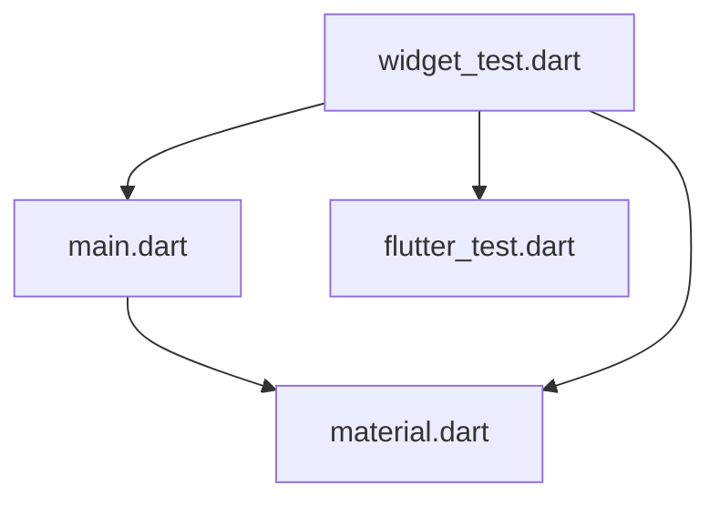

# SmaCC Dart

This is a dart parser made in Pharo.

## Installation

To install it, first create a [BLMoose image](https://gitlab.forge.berger-levrault.com/bl-drit/bl-moose/bl-moose).

Then, in a playground perform:

```st
Metacello new
  githubUser: 'Evref-BL' project: 'SmaccDart' commitish: 'main' path: 'src';
  baseline: 'SmaccDart';
  onConflict: [ :ex | ex useIncoming ];
  onUpgrade: [ :ex | ex useIncoming ];
  onDowngrade: [ :ex | ex useLoaded ];
  load
  
```

## Usage

To parse a string: 

```st
DartParser parse:  'class A {
  final int myInt;
  final String myString;
}'
```

From a file

```st
DartParser parseFile:  'path/to/the/file.dart'
```

## Example of parsing dependencies of Dart file 

With the project [dart-dep-resolver](https://github.com/Evref-BL/dart-dep-resolver), we use the parser to look for dependencies between dart file (using import declaration) and create a Mermaid diagram of these dependencies. 




## Developer

You will find the grammar used for the parser in the file `grammar/dart.g`.
To reimport it, use:

```st
definition := ('path\to\grammar\dart.g' asFileReference contents).
grammarCompiler := SmaCCGrammarCompiler new.
grammarCompiler codeGenerator defaultCategory: 'SmaCC_Dart'.
grammarCompiler
	buildDefinition: definition;
	compileInto: 'DartScanner' andParser: 'DartParser'.
```

You can modify the dart.g file to improve the parser.

> Each time you modify the .g file, remember to regenerate before commiting

## SmaCC documentation

Please refer to the [official book](http://books.pharo.org/booklet-Smacc/html/Chapters/Smacc/SmaccDirectives.html) of SmaCC (or its [archived version](https://web.archive.org/web/20210925202114/http://books.pharo.org/booklet-Smacc/html/Chapters/Smacc/SmaccDirectives.html)).

